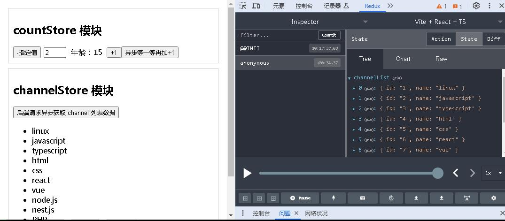

本文由作者 Samdy_Chan 原创，未经作者同意，不得随意转载！

### **使用轻量级第三方的 React 状态管理库 zustand 管理共享状态数据**

&emsp;&emsp;在 react 框架应用中，开发者应该大多数都是采用 redux 状态管理工具库来管理应用的共享状态数据，但用过 redux 的人都知道，其配置和使用相当复杂繁琐，先要定义对应操作状态数据方法的 action，然后创建 reducer 函数，在函数内要分别根据不同 action 对状态数据做不同的操作，还要根据 reducer 创建 store 对象，如果对于异步操作的 action，还需要安装第三方支持异步 action 的中间件库 redux-thunk，使用和配置起来非常麻烦。

&emsp;&emsp;虽然后来出现了精简版的 redux 状态管理库：@reduxjs/toolkit(RTK)，对其之前使用原始 redux 库的配置和操作进行了精简处理，而且不用再自己手动安装用于支持异步 action 的 redux-thunk 库，安装时，其会自动安装 redux-thunk 库。也无须开发者自己手动配置和注册 redux-thunk，其使用步骤精简了不少。但一般来说，对于异步 action 函数还是需要和同步 action 进行分别定义，然后在异步 action 里再调用同步 action。

&emsp;&emsp;**所以现在，给大家推荐一个更加轻量级的，速度更快的，配置简单，对 TS 类型支持友好的另一个第三方状态数据管理工具库 zustand，目前最新版本为 5.0.2，是一个塞尔维亚人开发。**

**zustand 该状态管理库的主要优点如下：**
- 将状态变量（当前也是自带响应式的），及操作状态变量的 action 函数在同一个返回对象中定义；
- 对于异步 action 函数，没有任何区别，也是在一起定义即可，无须像redux 那样分别定义；
- 在定义状态变量的 action 函数的同一个返回对象中，可以同时定义多个状态变量，以及对应多个操作状态变量的 action 函数；
- 也可以分模块，将不同模块或功能的状态变量及其对应的 action 函数定义在不同的 store 文件中，再通过组合导出；
- zustand 同时也支持通过调用 zustand/middleware 中间件函数 devtools()，将操作状态数据的过程和结果在浏览器的调试工具栏（F12）中的 redux devtools 插件面板中显示出来，前提是要先安装有 redux devtools 该浏览器插件，如下图所示：

&emsp;&emsp;&emsp;即使没有安装该插件，也不影响使用；


## **zustand 的安装配置及使用说明**

### **一、安装 zustand**
```sh
# yarn 推荐用 yarn，就因为 react 和 yarn 都是 Facebook Meta 公司开发的，哈哈^_^
yarn add zustand

# npm
npm i zustand

# pnpm 
pnpm add zustand
```

<br/>

## **二、配置和使用 zustand store：分模块配置**

- #### **2.1、本案例创建两个 store 模块文件，分别为实现年龄计数器状态数据和对应操作增减年龄状态数据 action 方法的 store；及通过异步 action 获取频道列表数据保存到 channelList 状态变量的 store。分别定义在 src/store/counterStore.ts 及 src/store/channelStore.ts 文件中，这两个 store 的定义脚本内容如下：**

- **2.1.1、\<src/store/counterStore.ts\>**
```js
// src/store/counterStore.ts

// 导入 zustand 状态管理库创建 store 的方法 create
import { create } from 'zustand';

// 定义counterStore（包括状态变量和操作方法）的数据类型
export type CounterStoreType = {
  count: number;
  incrCount: Function;
  decrCount: (val?: number) => void;
  asyncIncrCount: () => Promise<void>;
};

// 创建并导出 counter 模块的 store 对象
export const useCounterStore = create<CounterStoreType>((set, get) => {
  // zustand.create 方法的回调函数需要返回一个包含初始化状态数据和操作状态数据方法的对象
  return {
    // 初始化状态数据
    count: 0,

    // 增加状态数据的方法
    incrCount: () => {
      // 如果需要引用原本 state 状态 count 的值，set 函数里需要传入 state
      set((state) => ({ count: state.count + 1 }));
      // set((state) => ({ count: get().count + 1 })); // 或使用 get().count 获取 state.count 的值
      // 如果不需要引用原本 state.count 的值，set 函数无须传入 state 参数
      // set(() => ({ count: 10 }));
    },

    // 递减状态数据的方法
    decrCount: (val = 1) =>
      set((state) => {
        if (state.count - val <= 0) {
          alert('年龄不能<=0，不能再减了');
          // 即使不操作也必须返回状态变量原数据，否则页面可能渲染不正确
          return { count: state.count };
        }
        return { count: state.count - val };
      }),

    // 异步方法：等一等再加，异步修改状态数据的方法
    asyncIncrCount: async () => {
      // 在同步方法 asyncIncrCount 内定义异步[等一等再加]方法
      const waitIncr = () => {
        return new Promise((resolve) => {
          setTimeout(() => {
            resolve(set((state) => ({ count: state.count + 1 })));
          }, 1000); // 2秒后再增加 state.count 状态变量
        });
      };

      // 调用异步[等一等再加]方法
      await waitIncr();
    },

    /** 在 zustand 的 create 函数这里，还可以同时定义更多的状态变量和相关的方法，如下： */
    // count2: 1,
    // incrCount2: () => {},
    // decrCount2: () => {},
  };
});
```

<br/>

- **2.1.2、\<src/store/channelStore.ts\>**
```js
// src/store/channelStore.ts

// 导入 zustand 状态管理库创建 store 的方法 create
import { create } from 'zustand';

// 如果安装了 redux 浏览器开发者插件，还可以导入 zustand 的中间件函数 devtools，
// 可以在调用 zustand 的修改状态变量方法时，在 redux 浏览器的插件中观察状态变量的变化等情况
import { devtools } from 'zustand/middleware';

// 定义 channelStore（包括状态变量和操作方法）的数据类型
export type ChannelStoreType = {
  channelList: { id: number; name: string }[];
  getChannelList: () => Promise<void>;
};

// 创建并导出 channel 模块的 store 对象
export const useChannelStore = create(
  // 如果安装了 redux 浏览器开发者插件，还可以使用 zustand 的中间件函数 devtools，
  // 可以在调用 zustand 的修改状态变量方法时，在 redux 浏览器的插件中观察状态变量的变化等情况
  devtools<ChannelStoreType>((set) => {
    // zustand.create 方法的回调函数需要返回一个包含初始化状态数据和操作状态数据方法的对象
    return {
      // 初始化状态数据
      channelList: [],

      // 异步获取 channelList 数据的方法
      getChannelList: async () => {
        // zustand 状态管理库的异步方法也和同步方法一样，也在这里直接定义就可以了，比 redux 方便很多
        const res = await fetch('http://localhost:8888/channels');
        const data: ChannelStoreType['channelList'] = await res.json();
        console.log('channelList data:', data);

        // 保存获取到的 channelList 数据到状态变量中
        set((state) => ({ channelList: data }));
      },
    };
  })
);

```

<br/>

- **2.1.3、在 src/store/index.ts 中组合导出以上 counterSTore.ts 和 channelStore.ts 文件中的状态变量和对应的 action 方法**
```js
// src/store/index.ts

// 导出 counterStore，使用 import { useCounterStore} from '@/store'
export * from './counterStore';

// 导出 channelStore，使用 import { useChannelStore} from '@/store'
export * from './channelStore';
```

<br/>

- #### **2.2、使用 counterStore 和 channelStore**

- **2.2.1、在 TestZustand 页面组件 src/views/TestZustand/index.tsx 中导入并使用counterStore 和 channelStore**
```js
// src/views/TestZustand/index.tsx

import React, { useState } from 'react';

// 以模块导入样式，可以防止类名重名问题，保证每个类名在整个应用全局都是唯一的
import styles from './index.module.scss';
// console.log('styles:', styles);

// 导入 counterStore 和 channelStore 相当于 redux 的 reducers 函数，用于获取状态变量和操作状态变量的方法
import { useCounterStore, useChannelStore, type CounterStoreType, type ChannelStoreType } from '@/store';

const TestZustand: React.FC = () => {
  // 获取 counterStore 的态变量和操作状态变量的方法
  const { count, incrCount, decrCount, asyncIncrCount }: CounterStoreType = useCounterStore();

  // 获取 channelStore 的态变量和操作状态变量的方法
  const { channelList, getChannelList }: ChannelStoreType = useChannelStore();

  const [decrVal, setDecrVal] = useState(1);

  const fetchChannelList = async () => {
    await getChannelList();
  };

  return (
    <div className={styles.testBox}>
      {/* counterStore 模块 */}
      <div className={styles.counterStoreBox}>
        <h2>countStore 模块</h2>
        <button onClick={() => decrCount(decrVal)}>-指定值</button>
        <input
          type="number"
          value={decrVal}
          style={{ width: 40, marginLeft: 6 }}
          onInput={(e) => setDecrVal(+(e.target as HTMLInputElement).value)} // 前+号用于数字字符转数值型
        />
        <span className={styles.age}>年龄：{count}</span>
        <button onClick={() => incrCount()}>+1</button>
        <button onClick={asyncIncrCount}>异步等一等再加+1</button>
      </div>

      {/* channelStore 模块 */}
      <div className={styles.channelStoreBox}>
        <h2>channelStore 模块</h2>
        <button onClick={async () => await fetchChannelList()}>后端请求异步获取 channel 列表数据</button>
        {/* 渲染 channelList 数据 */}
        <ul>
          {channelList.map((channel) => {
            return <li key={channel.id}>{channel.name}</li>;
          })}
        </ul>
      </div>
    </div>
  );
};

export default TestZustand;
```

<br/>

- **2.2.2、在根组件 App 中引入 TestZustand 页面组件进行测试**
```js
// src/App.tsx

import TestZustand from '@/views/TestZustand';

export default function App() {
  return (
    <>
      <TestZustand />
    </>
  );
}

```

<br/>

### **三、获取本案例项目源码**
- **Github:** https://github.com/Samdy-Chan/react-zustand-project (外网，可能需要代理软件才能下载)
- **Gitcode:** https://gitcode.com/Samdy_Chan/react-zustand-project (推荐: 国内CSDN代码仓库)

<br/>

### **四、运行项目**
- yarn install 或 npm i（下载本项目后，先安装全局依赖）

- yarn dev 或 npm run dev

- 说明：本项目集成了 json-server，一个简易的 api server 库，用于在 channelStore 中的异步 action 方法 getChannelList 中通过 api 异步获取服务端的数据，执行 yarn dev 或 npm run dev 时，会自动启动 json-server 服务端接口 http://localhost:8888/channels ，在 getChannelList action 中通过该 api url 异步获取频道列表数据。

- **本案例项目运行界面图**

